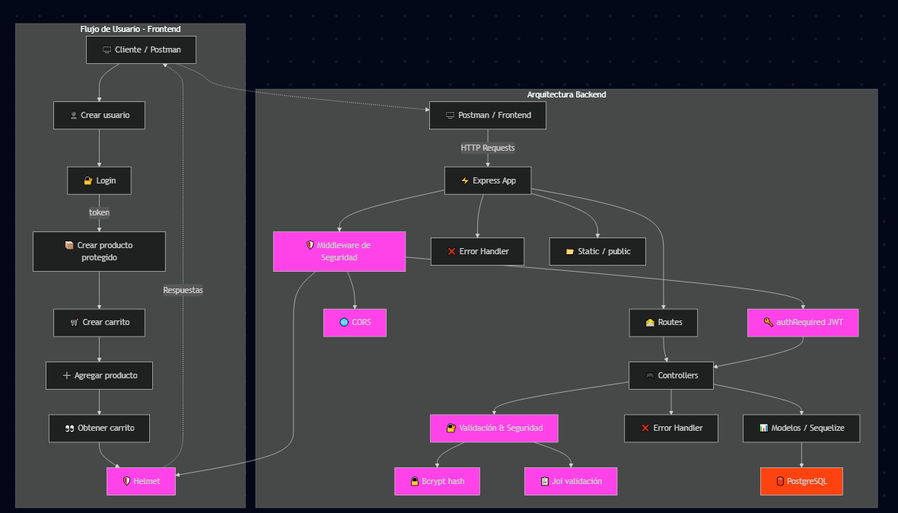

# Seguridad y Arquitectura

> Coloca la imagen compartida en `docs/arquitectura_backend.png`.

## Capas de la Aplicación
- Express App: parsing JSON, estáticos, enrutado.
- Middlewares: `helmet`, `cors`, `authRequired` (JWT), `errorHandler`.
- Routes: agregan el middleware JWT donde corresponde.
- Controllers: validaciones de negocio y acceso a modelos.
- Models (Sequelize): tipos, constraints, defaults.
- DB: PostgreSQL vía `DATABASE_URL`.

## Autenticación y Autorización
- JWT
  - Login: `POST /auth/login` y `POST /usuarios/login` → `{ token, expiresIn, usuario }`.
  - Verificación en `authRequired`: exige `Authorization: Bearer <token>`.
  - Expiración configurable: `.env` → `JWT_EXPIRES_IN`.
- Rutas protegidas
  - `POST /productos` y todo `carritos` requieren token.
- Roles (base)
  - `role` en `User` (`admin`, `user`); se puede ampliar para restringir creación de productos.

## Validaciones y Seguridad de Datos
- Hash de contraseña con `bcrypt` (`User.beforeCreate`).
- Validaciones de controladores
  - IDs válidos (`usuarioId` entero ≥ 1) y existencia de entidades.
  - Verificación de stock en checkout; retorno 400 con `productoId` insuficiente.
- Constraints de Sequelize
  - `email` único, `role` enum, `estado` booleano.
- Manejo de errores global
  - Traduce errores de validación, duplicados, FK, y JSON inválido a 4xx.

## Métodos Clave
- Usuarios: CRUD básico y login.
- Productos: creación protegida, listados y detalle.
- Carritos: crear, agregar, eliminar, obtener carrito, obtener total y checkout.
- Checkout (nuevo)
  - Transacción: reduce stock, graba compra en `User.productos_comprados`, vacía items del carrito.
  - Respuesta: `{ mensaje, total, detalles[] }`.

## Roles y Permisos
- Todos los usuarios autenticados (role "user") pueden crear productos y comprar: actúan como vendedores y compradores.
- El role "admin" no se asigna por ahora; reservado para gestión de cuentas futura.
- `POST /productos` permanece habilitado para usuarios autenticados; cuando se habilite `admin`, podrá restringirse a ese rol.

## Mejoras Recientes
- Validación robusta de `usuarioId` y corrección de `include` anidado para `CarritoItem` y `Product`.
- Implementación de `POST /carritos/checkout` con transacción y verificación de stock.
- Postman Collection `Postman_Para_Tienda.json` con login y checkout.
- README actualizado con seguridad, arquitectura y ejemplos.

## Recomendaciones Adicionales
- Limitar CORS a orígenes permitidos.
- Rate limiting en login y endpoints sensibles.
- Auditoría/Orders: registrar compras y estados en una entidad de órdenes.
- Política de roles: restringir alta de productos a `admin`.
- Validar payloads con una librería (p.ej. `joi`).